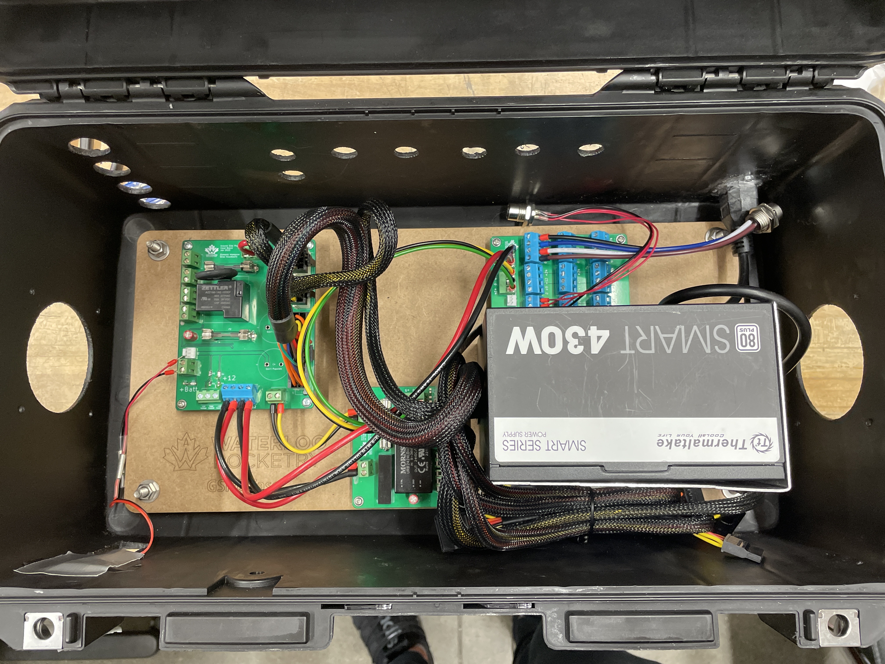
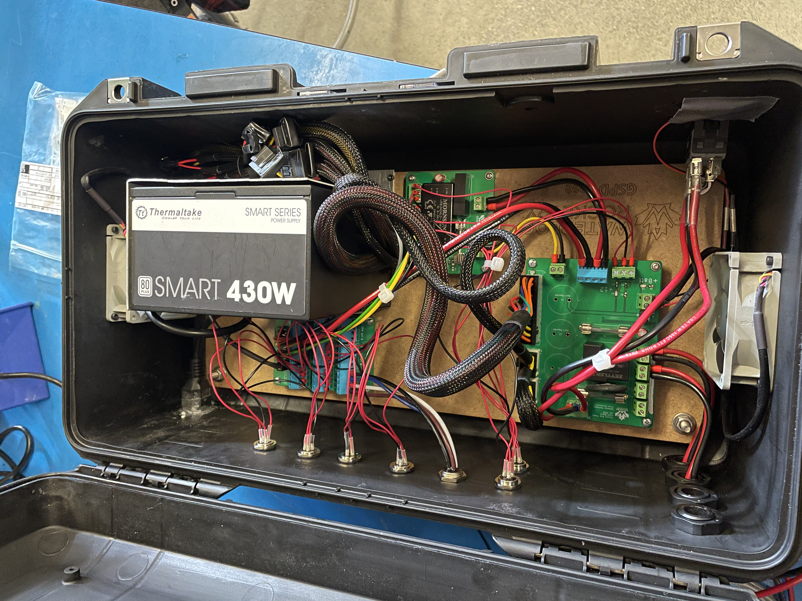

# GSPD
<h4>Ground System Power Distribution (GSPD) is a power distribution system designed for Waterloo Rocketry, a student design team at the Univeristy of Waterloo that launches
    a student build hybrid rocket to 30,000ft anually!</h3>

<h4>The purpose of this system is to provide a centralized and reliable power supply for all the rocket's ground side equipement. </h4>

  <table>
    <tr>
      <td style="text-align:center;">
        
        <h6 align='center'>Better View of Just the Boards</h6>
      </td>
      <td style="text-align:center;">
        
        <h6 align='center'>Fully Assembled GSPD</h6>
      </td>
    </tr>
  </table>

<h4>GSPD can supply up to 250W of power, receiving input from either a generator or car batteries. It provides 5V, 12V and 24V lines to the ground equipement via an array of M12 connectors. The Kicad designed boards incorporate
    power protection mechanisms and are housed in a waterproof and dustproof housing with integrated cooling for optimal performance in all conditions.</h4>
